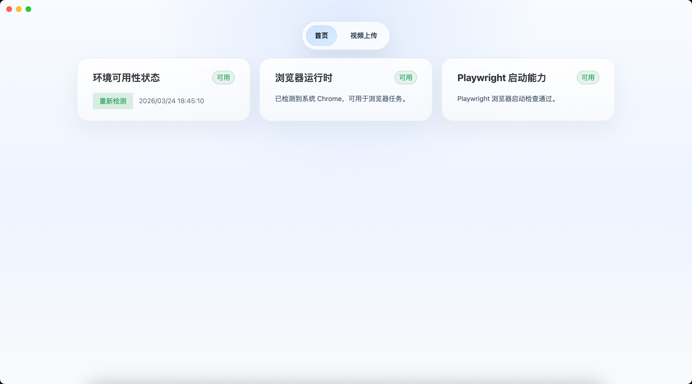
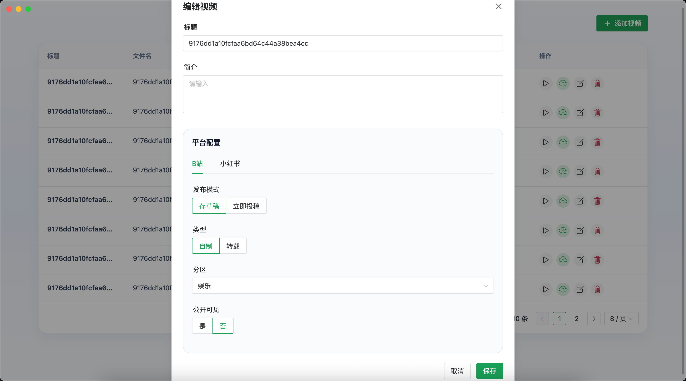

# LazySync

帮助自媒体工作者将视频一键发布到多个平台，如B站、小红书等，项目基于 *Playwright* 实现自动上传，并提供了友好的可视化操作界面


## 运行截图

> 目前只测试了 *Chrome* 浏览器，其他浏览器暂时未测试






## 支持平台
<table border="1">
  <tr>
    <th>平台</th>
    <th>支持</th>
  </tr>
  <tr>
    <td>B站</td>
    <td>✅</td>
  </tr>
  <tr>
    <td>小红书</td>
    <td>✅</td>
  </tr>
</table>

## 使用手册

1. 选择本地视频
2. 编辑视频的信息
3. 点击上传按钮上传到指定平台


## 技术栈

- Electron
- Vue 3
- Vite
- TypeScript
- Naive UI
- SQLite（`better-sqlite3`）
- Playwright

## 开发

```bash
./run_dev.sh
```


## 打包

```bash
./pack.sh
```

打包输出目录再 `dist/` 下
